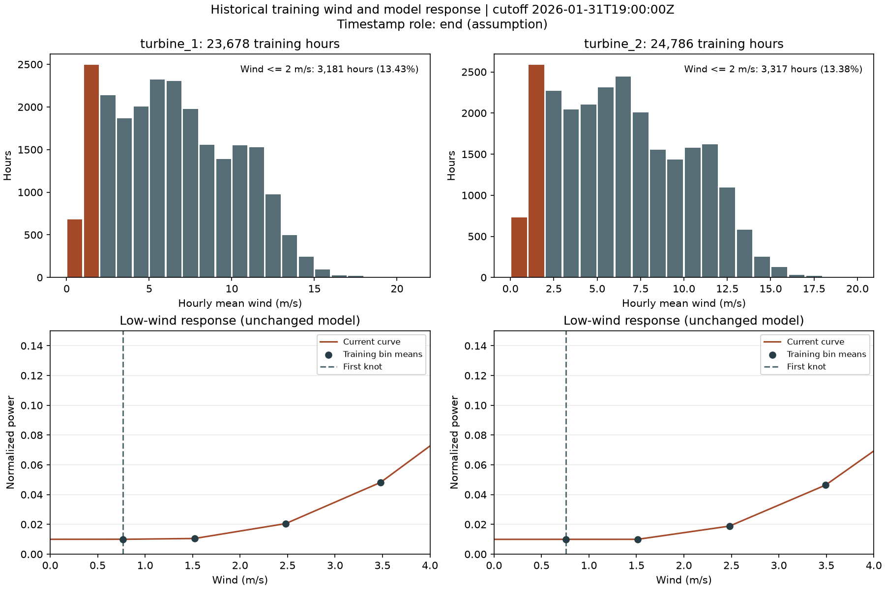

# Проверка малых скоростей ветра

2026-09-23. Использованы исходники организатора с проверенными SHA256, штатная агрегация
`data.history.hourly_history` и неизменённая `backend.model.build_curves`.
Срез: 2026-01-31T19:00:00Z, роль метки `end` как допущение. Учитываются только полные часы,
которые попадают в расчёт кривой; это распределение обучающих входов, не прогнозной погоды.



| Показатель | Турбина 1 | Турбина 2 |
|---|---:|---:|
| Полных обучающих часов | 23 678 | 24 786 |
| Часов со скоростью ≤2 м/с | 3 181 | 3 317 |
| Доля этих часов | 13,43% | 13,38% |
| Средняя фактическая мощность при ≤2 м/с | 0,01040 | 0,00996 |
| Скорость первой опорной точки, м/с | 0,7673 | 0,7598 |
| Мощность крайней точки | 0,009983 | 0,009947 |
| Расчёт при 2 м/с | 0,015514 | 0,014433 |

Ниже первой опорной точки модель возвращает её мощность и устанавливает `extrapolated=true`.
Это граница средних значений ветровых интервалов, а не обязательно минимум исходных наблюдений.
При 1–2 м/с выполняется интерполяция. Низкие значения около 0,01 согласуются со средними
наблюдаемыми мощностями при слабом ветре; оснований менять эту ветвь модели по данному аудиту нет.
Это проверка поведения baseline, не доказательство физической точности при нулевом ветре или
качества февраля на неизвестных фактических данных.

## Повтор пользовательского сценария

1 февраля 2026, 17:00 UTC, 24 часа, обе турбины: по 24 точки; ветер 0,737–3,410 м/с.
По 9 часов имеют ветер ≤2 м/с: мощность 0,009983–0,014949 для первой турбины и
0,009947–0,013936 для второй. Всего по одному часу с `extrapolated=true`.
Максимум мощности всего запуска 0,04624/0,04416 относится к ветру около 3,41 м/с.
Второй реальный запрос: 14 февраля 19:00 UTC, 48 часов, турбина 2; 48 точек,
4 часа с ветром ≤2 м/с, мощность 0,009947–0,009964 в этих часах.

Оба запроса получили реальные ответы OpenAI. Параметры и результаты проверки сохранены в
`live-checks.json`; полный счётчик ветровых интервалов и контрольные суммы — в `summary.json`.
Время повторных запусков меньше первоначального из-за прогретых погодного и исторического кэшей.

## Воспроизведение графика

Из корня репозитория в Python-окружении:

```sh
python -m pip install -r backend/requirements-audit.txt
python -m backend.audit_low_wind --output-dir backend/runtime/low-wind-recheck --timestamp-role end
```

Каталог результата должен быть новым. Matplotlib нужен только для этого аудита, сервер его не использует.
Скрипт строит гистограммы с шагом 1 м/с, считает долю ≤2 м/с и проверяет модель на 0/0,5/1/1,5/2 м/с.
