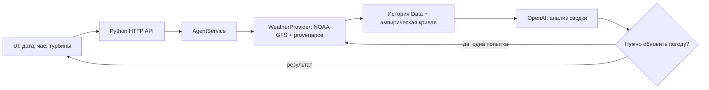

# Архитектура Ветропрогноза

## Фактический источник погоды

Рабочий цикл использует **NOAA GFS, сетка 0.5°, публичный архив AWS S3**
`https://noaa-gfs-bdp-pds.s3.amazonaws.com`. Получаются GRIB2 конкретного выпуска:
компоненты ветра U/V на 100 м и температура на 2 м. Скорость вычисляется из U/V;
трёхчасовые прогнозные поля одного выпуска интерполируются на почасовую сетку.
Выбор выпуска учитывает as_of, а проверка issued_at и Last-Modified объектов подтверждает,
что используемая версия была опубликована не позже прогнозного момента. Пакеты и provenance
сохраняются в `data/weather` или локальном кэше backend.

Open-Meteo не участвует в получении погоды для прогноза мощности. Его ранее предоставленный
пример сохранён только для отдельной проверки формата шага анализа погоды.

- `data/raw`: исходная история gzip, SHA256, неизменяемая поставка организаторов. `data/history.py` фильтрует по cutoff и строит полные часы.
- `data/weather_gfs.py`: архив NOAA GFS 0.5°, U/V 100 m и температура 2 m, проверка GRIB и времени публикации S3. В backend декодирование выполняется последовательно для совместимости ecCodes на Windows.
- `backend/weather_provider.py`: сначала проверенный кэш, затем включённый архив; при отсутствии или явном обновлении скачивает реальный выпуск. Версии сохраняются отдельно с provenance. Повреждённый пакет даёт ошибку.
- `backend/model.py`: исторические интервалы ветра шириной 1 м/с, средняя мощность и линейная интерполяция между опорными точками каждой турбины. Выход за диапазон отмечается в ответе.
- `backend/service.py`: контракт, подготовка истории, SHA-проверка и кэш кривой, численный прогноз. Только данные не позднее cutoff.
- `backend/agent.py`: получение погоды → расчёт → OpenAI. При рекомендации refresh_weather одна попытка обновления; при изменении входов пересчёт и второй анализ. Максимум два вызова модели на запрос.
- `backend/openai_analysis.py`: Responses API, структурированный ответ, store=false; модель объясняет риски по сводке, численные прогнозы рассчитываются локально.
- `backend/server.py`: JSON API на 8000, строгие ошибки, CORS для локального UI.
- `ui`: ES modules, статический Node-сервер 3000. API-ключа и расчётной модели в браузере нет. Показывает значения и выполненные этапы из ответа backend.
- `backend/batch_forecast.py`: воспроизводимые 28 численных запусков без затрат OpenAI; JSON и CSV для февраля.

Хранение файловое; отдельная БД не требуется. Точные поля и правила находятся в api-contract.md и db-schema.md. Docker Compose изолирует backend/UI; сборка ещё требует проверки на Docker Engine. Доступ и ограничения источников описаны в resources-needed.md и README.
